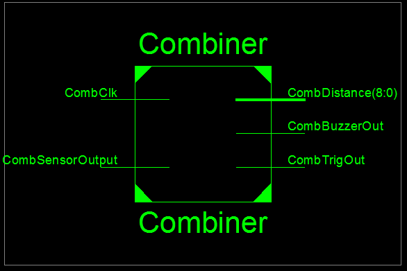
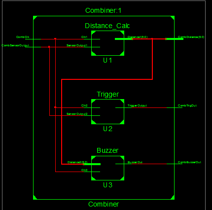

# FPGA Parking Sensor
Using a custom FPGA board and an HC-SR04 ultrasonic distance sensor, a parking sensor system is implemented. The main structure takes the sensor output and system clock as its inputs. With the sytem clock a trigger signal is generated to initiate sensor measurement. The system will measure how long it took for the ultrasonic soundwave to bounce back to the sensor by measuring the time it took for the sensor output to switch from HIGH to LOW. If the sensor still did not detect the sound wave after 250.01 ms (measurement period), the sensor is triggered for measurement again. Depending on the measurement time, a basic distance calculation is made by using the speed of sound and time it took for the sensor to detect the sound wave. This information is then used to create visual and auditory indicators regarding the object distance with LEDs and a buzzer.
## The System Schematics

## System in Action

